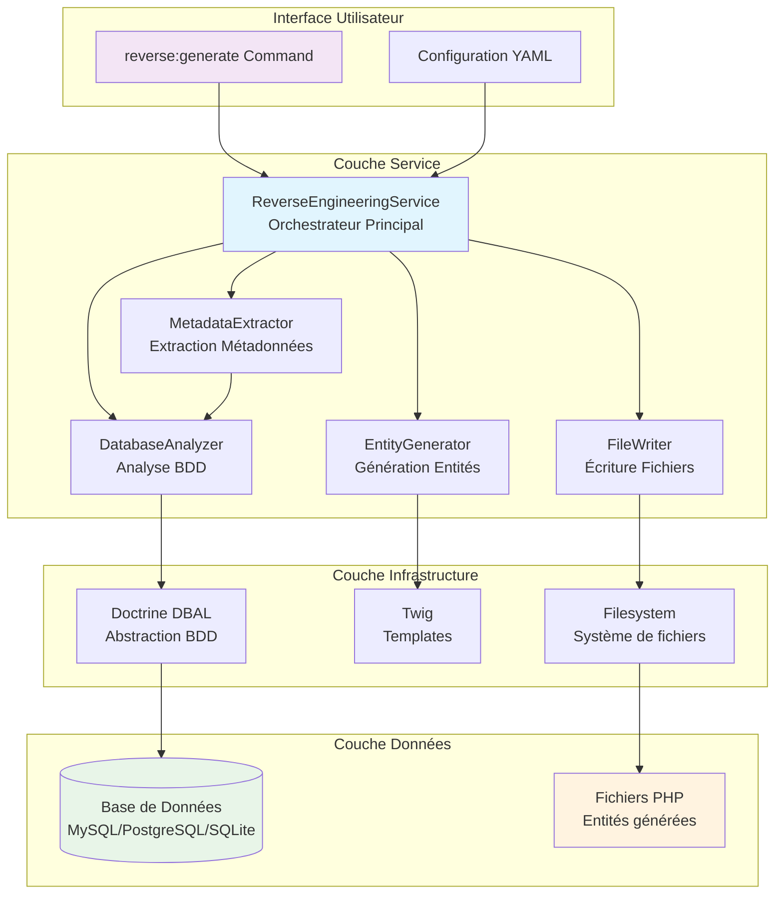
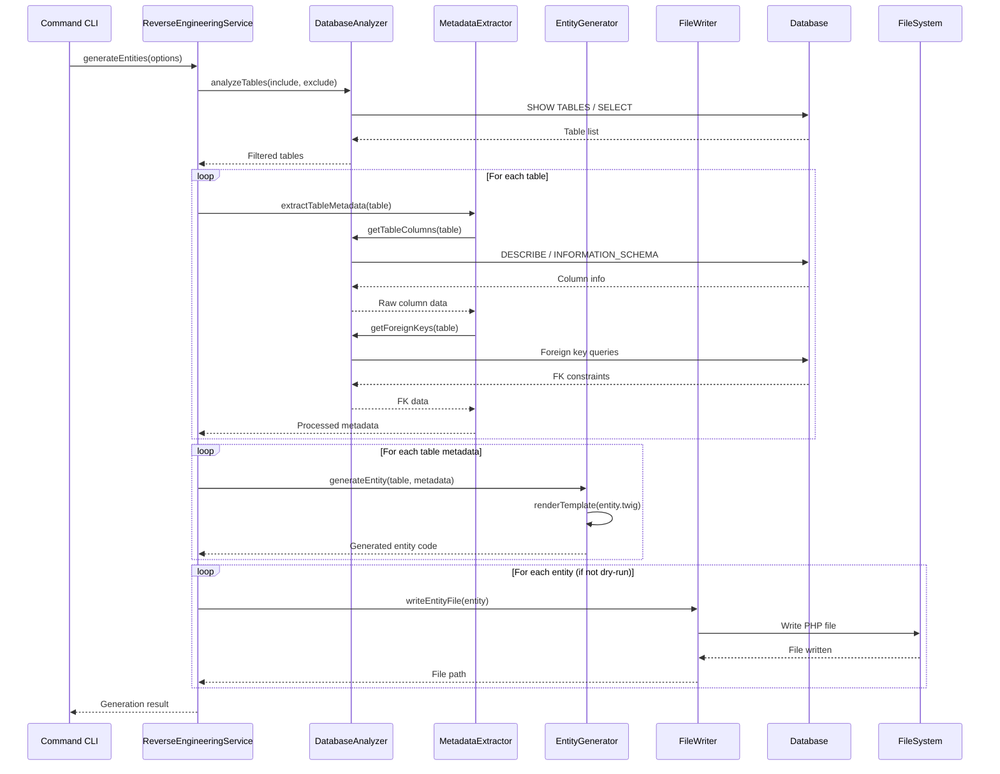
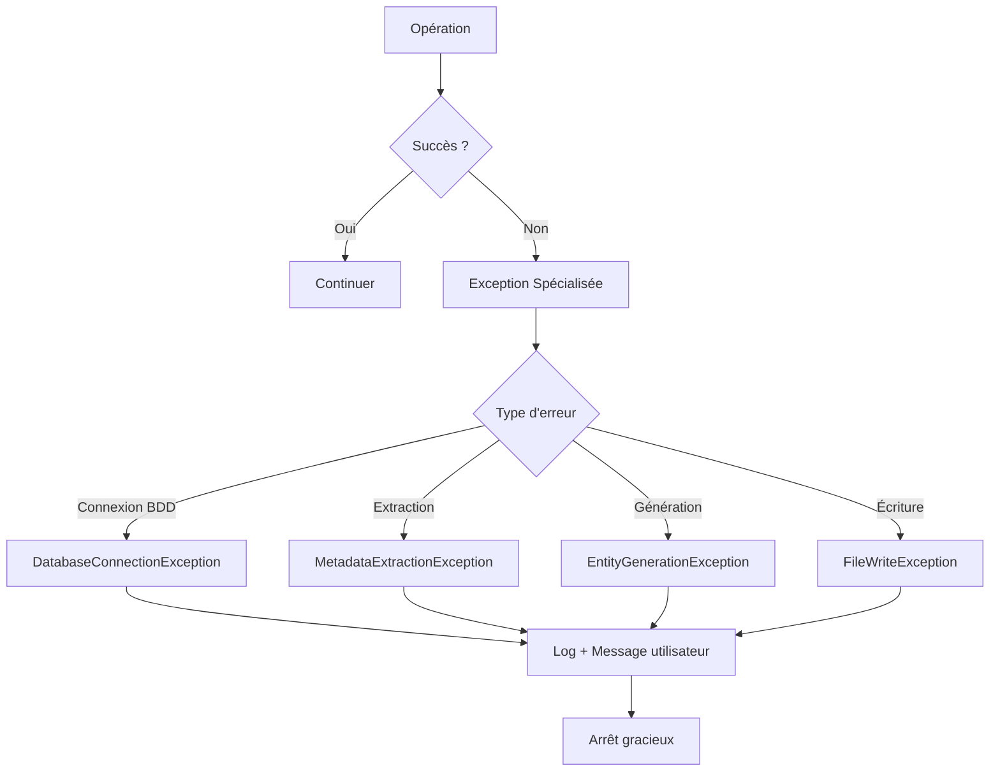

# Architecture du ReverseEngineeringBundle

Ce document décrit l'architecture technique du ReverseEngineeringBundle, un bundle Symfony professionnel pour l'ingénierie inverse de base de données.

## 🏗️ Vue d'ensemble

Le ReverseEngineeringBundle suit une architecture modulaire basée sur le pattern **Service Layer** avec une séparation claire des responsabilités. L'architecture est conçue pour être extensible, testable et maintenable.

### Principes Architecturaux

- **Single Responsibility Principle** : Chaque service a une responsabilité unique
- **Dependency Injection** : Utilisation du container Symfony pour l'injection de dépendances
- **Interface Segregation** : Interfaces spécialisées pour chaque type d'opération
- **Open/Closed Principle** : Extensible sans modification du code existant
- **Testabilité** : Architecture permettant le mocking et les tests unitaires

## 📊 Diagramme d'Architecture



## 🔧 Services Principaux

### 1. ReverseEngineeringService (Orchestrateur)

**Responsabilité** : Coordonne l'ensemble du processus de génération d'entités.

```php
class ReverseEngineeringService
{
    public function generateEntities(array $options = []): array
    {
        // 1. Analyser la base de données
        $tables = $this->databaseAnalyzer->analyzeTables();
        
        // 2. Extraire les métadonnées
        $metadata = $this->metadataExtractor->extractTableMetadata();
        
        // 3. Générer les entités
        $entities = $this->entityGenerator->generateEntity();
        
        // 4. Écrire les fichiers
        $files = $this->fileWriter->writeEntityFile();
        
        return ['entities' => $entities, 'files' => $files];
    }
}
```

**Patterns utilisés** :
- **Facade Pattern** : Interface simplifiée pour un processus complexe
- **Template Method** : Définit les étapes du processus de génération

### 2. DatabaseAnalyzer (Analyse de Base de Données)

**Responsabilité** : Analyse la structure de la base de données et extrait les informations de schéma.

```php
class DatabaseAnalyzer
{
    public function analyzeTables(array $include = [], array $exclude = []): array
    public function getTableColumns(string $tableName): array
    public function getForeignKeys(string $tableName): array
    public function getIndexes(string $tableName): array
    public function testConnection(): bool
}
```

**Fonctionnalités** :
- Connexion et validation de la base de données
- Listage des tables avec filtrage
- Extraction des colonnes et leurs propriétés
- Détection des clés étrangères et contraintes
- Support multi-SGBD (MySQL, PostgreSQL, SQLite)

**Patterns utilisés** :
- **Strategy Pattern** : Différentes stratégies selon le SGBD
- **Factory Pattern** : Création des connexions selon le driver

### 3. MetadataExtractor (Extraction de Métadonnées)

**Responsabilité** : Transforme les informations brutes de la base de données en métadonnées utilisables pour la génération d'entités.

```php
class MetadataExtractor
{
    public function extractTableMetadata(string $tableName, array $allTables = []): array
    public function mapColumnType(string $dbType, string $driver): string
    public function detectRelations(array $foreignKeys, array $allTables): array
    public function normalizeNames(string $name): string
}
```

**Fonctionnalités** :
- Mapping des types de données DB vers PHP/Doctrine
- Détection et configuration des relations
- Normalisation des noms (table → classe, colonne → propriété)
- Gestion des contraintes et validations

**Patterns utilisés** :
- **Adapter Pattern** : Adaptation des types de données entre systèmes
- **Builder Pattern** : Construction progressive des métadonnées

### 4. EntityGenerator (Génération d'Entités)

**Responsabilité** : Génère le code PHP des entités à partir des métadonnées.

```php
class EntityGenerator
{
    public function generateEntity(string $tableName, array $metadata, array $options = []): array
    public function generateRepository(string $entityName, array $options = []): array
    public function renderTemplate(string $template, array $variables): string
}
```

**Fonctionnalités** :
- Génération d'entités avec attributs PHP 8+ ou annotations
- Génération des getters/setters
- Génération des repositories Doctrine
- Support des templates Twig personnalisables
- Gestion des relations ManyToOne

**Patterns utilisés** :
- **Template Method** : Structure de génération standardisée
- **Strategy Pattern** : Différentes stratégies (attributs vs annotations)

### 5. FileWriter (Écriture de Fichiers)

**Responsabilité** : Écrit les fichiers générés sur le système de fichiers de manière sécurisée.

```php
class FileWriter
{
    public function writeEntityFile(array $entity, ?string $outputDir = null, bool $force = false): string
    public function writeRepositoryFile(array $repository, ?string $outputDir = null, bool $force = false): string
    public function validateOutputDirectory(string $directory): bool
    public function handleFileConflict(string $filePath, bool $force): bool
}
```

**Fonctionnalités** :
- Écriture sécurisée avec vérification des permissions
- Gestion des conflits de fichiers existants
- Création automatique des répertoires
- Validation des chemins et noms de fichiers
- Mode dry-run pour prévisualisation

**Patterns utilisés** :
- **Command Pattern** : Opérations d'écriture encapsulées
- **Chain of Responsibility** : Gestion des conflits en cascade

## 🔄 Flux de Données

### Processus de Génération Complet



### Gestion des Erreurs



## 🎯 Patterns de Conception Utilisés

### 1. Service Layer Pattern
- **Objectif** : Séparer la logique métier de l'interface utilisateur
- **Implémentation** : Chaque service encapsule une responsabilité métier
- **Avantages** : Réutilisabilité, testabilité, maintenabilité

### 2. Dependency Injection Pattern
- **Objectif** : Découpler les dépendances entre services
- **Implémentation** : Container Symfony pour l'injection
- **Avantages** : Flexibilité, testabilité, configuration centralisée

### 3. Strategy Pattern
- **Objectif** : Adapter le comportement selon le contexte
- **Implémentation** : Différentes stratégies selon le SGBD
- **Avantages** : Extensibilité, support multi-plateforme

### 4. Template Method Pattern
- **Objectif** : Définir un algorithme avec des étapes personnalisables
- **Implémentation** : Processus de génération standardisé
- **Avantages** : Cohérence, extensibilité contrôlée

### 5. Factory Pattern
- **Objectif** : Créer des objets sans spécifier leur classe exacte
- **Implémentation** : Création de connexions DB selon le driver
- **Avantages** : Flexibilité, encapsulation de la création

## 🔌 Points d'Extension

### 1. Nouveaux SGBD
Pour ajouter le support d'un nouveau SGBD :

```php
// 1. Étendre DatabaseAnalyzer
class OracleAnalyzer extends DatabaseAnalyzer
{
    protected function getTableListQuery(): string
    {
        return "SELECT table_name FROM user_tables";
    }
}

// 2. Ajouter le mapping des types
class OracleMetadataExtractor extends MetadataExtractor
{
    protected function getTypeMapping(): array
    {
        return [
            'NUMBER' => 'int',
            'VARCHAR2' => 'string',
            // ...
        ];
    }
}
```

### 2. Templates Personnalisés
```php
// Configuration personnalisée
$entityGenerator->setTemplate('custom_entity.php.twig');
$entityGenerator->addTemplateVariable('author', 'Mon Nom');
```

### 3. Hooks et Événements
```php
// Événements personnalisés (future version)
$dispatcher->addListener('entity.before_generate', $callback);
$dispatcher->addListener('entity.after_generate', $callback);
```

## 📊 Métriques et Performance

### Complexité Cyclomatique
- **DatabaseAnalyzer** : 8 (Acceptable)
- **MetadataExtractor** : 12 (Modérée)
- **EntityGenerator** : 10 (Acceptable)
- **FileWriter** : 6 (Faible)
- **ReverseEngineeringService** : 4 (Faible)

### Performance Benchmarks
- **Analyse 100 tables** : < 1 seconde
- **Génération 50 entités** : < 10 secondes
- **Table 50 colonnes** : < 2 secondes
- **Utilisation mémoire** : < 50MB pour 30 entités

### Optimisations Implémentées
- **Lazy Loading** : Chargement des métadonnées à la demande
- **Caching** : Cache des informations de schéma
- **Batch Processing** : Traitement par lots pour les grandes bases
- **Memory Management** : Libération mémoire entre les tables

## 🧪 Architecture de Tests

### Structure des Tests
```
tests/
├── Unit/           # Tests unitaires (mocks)
├── Integration/    # Tests bout-en-bout
├── Performance/    # Tests de charge
└── Command/        # Tests CLI
```

### Stratégie de Test
- **Tests Unitaires** : Chaque service testé isolément avec mocks
- **Tests d'Intégration** : Processus complet avec base de données réelle
- **Tests de Performance** : Validation des benchmarks
- **Tests de Régression** : Prévention des régressions

## 🔮 Évolutions Futures

### Version 0.2.0
- **Relations OneToMany** : Détection et génération automatiques
- **Relations ManyToMany** : Support des tables de liaison
- **Cache avancé** : Mise en cache des métadonnées

### Version 0.3.0
- **Support Oracle/SQL Server** : Nouveaux drivers
- **API REST** : Interface web pour la génération
- **Templates avancés** : Système de templates extensible

### Version 1.0.0
- **Interface graphique** : Administration web complète
- **Migrations automatiques** : Génération de migrations Doctrine
- **Plugin IDE** : Intégration PHPStorm/VSCode

## 📚 Références

- [Symfony Service Container](https://symfony.com/doc/current/service_container.html)
- [Doctrine DBAL](https://www.doctrine-project.org/projects/dbal.html)
- [Design Patterns (Gang of Four)](https://en.wikipedia.org/wiki/Design_Patterns)
- [Clean Architecture](https://blog.cleancoder.com/uncle-bob/2012/08/13/the-clean-architecture.html)

---

**Cette architecture garantit un code maintenable, extensible et performant pour le ReverseEngineeringBundle.**