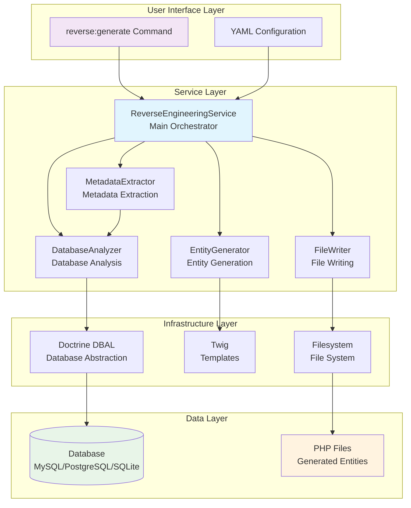
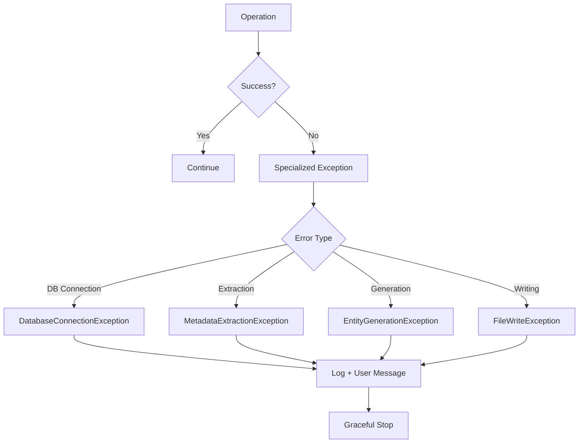

# ReverseEngineeringBundle Architecture

This document describes the technical architecture of the ReverseEngineeringBundle, a professional Symfony bundle for database reverse engineering.

## 🏗️ Overview

The ReverseEngineeringBundle follows a modular architecture based on the **Service Layer** pattern with clear separation of responsibilities. The architecture is designed to be extensible, testable, and maintainable.

### Architectural Principles

- **Single Responsibility Principle**: Each service has a unique responsibility
- **Dependency Injection**: Uses Symfony container for dependency injection
- **Interface Segregation**: Specialized interfaces for each operation type
- **Open/Closed Principle**: Extensible without modifying existing code
- **Testability**: Architecture enabling mocking and unit testing

## 📊 Architecture Diagram



## 🔧 Core Services

### 1. ReverseEngineeringService (Orchestrator)

**Responsibility**: Coordinates the entire entity generation process.

```php
class ReverseEngineeringService
{
    public function generateEntities(array $options = []): array
    {
        // 1. Analyze database
        $tables = $this->databaseAnalyzer->analyzeTables();
        
        // 2. Extract metadata
        $metadata = $this->metadataExtractor->extractTableMetadata();
        
        // 3. Generate entities
        $entities = $this->entityGenerator->generateEntity();
        
        // 4. Write files
        $files = $this->fileWriter->writeEntityFile();
        
        return ['entities' => $entities, 'files' => $files];
    }
}
```

**Patterns used**:
- **Facade Pattern**: Simplified interface for a complex process
- **Template Method**: Defines the steps of the generation process

### 2. DatabaseAnalyzer (Database Analysis)

**Responsibility**: Analyzes database structure and extracts schema information.

```php
class DatabaseAnalyzer
{
    public function analyzeTables(array $include = [], array $exclude = []): array
    public function getTableColumns(string $tableName): array
    public function getForeignKeys(string $tableName): array
    public function getIndexes(string $tableName): array
    public function testConnection(): bool
}
```

**Features**:
- Database connection and validation
- Table listing with filtering
- Column and property extraction
- Foreign key and constraint detection
- Multi-DBMS support (MySQL, PostgreSQL, SQLite)

**Patterns used**:
- **Strategy Pattern**: Different strategies per DBMS
- **Factory Pattern**: Connection creation based on driver

### 3. MetadataExtractor (Metadata Extraction)

**Responsibility**: Transforms raw database information into usable metadata for entity generation.

```php
class MetadataExtractor
{
    public function extractTableMetadata(string $tableName, array $allTables = []): array
    public function mapColumnType(string $dbType, string $driver): string
    public function detectRelations(array $foreignKeys, array $allTables): array
    public function normalizeNames(string $name): string
}
```

**Features**:
- DB to PHP/Doctrine data type mapping
- Relationship detection and configuration
- Name normalization (table → class, column → property)
- Constraint and validation management

**Patterns used**:
- **Adapter Pattern**: Data type adaptation between systems
- **Builder Pattern**: Progressive metadata construction

### 4. EntityGenerator (Entity Generation)

**Responsibility**: Generates PHP entity code from metadata.

```php
class EntityGenerator
{
    public function generateEntity(string $tableName, array $metadata, array $options = []): array
    public function generateRepository(string $entityName, array $options = []): array
    public function renderTemplate(string $template, array $variables): string
}
```

**Features**:
- Entity generation with PHP 8+ attributes or annotations
- Getter/setter generation
- Doctrine repository generation
- Customizable Twig template support
- ManyToOne relationship management

**Patterns used**:
- **Template Method**: Standardized generation structure
- **Strategy Pattern**: Different strategies (attributes vs annotations)

### 5. FileWriter (File Writing)

**Responsibility**: Writes generated files to the filesystem securely.

```php
class FileWriter
{
    public function writeEntityFile(array $entity, ?string $outputDir = null, bool $force = false): string
    public function writeRepositoryFile(array $repository, ?string $outputDir = null, bool $force = false): string
    public function validateOutputDirectory(string $directory): bool
    public function handleFileConflict(string $filePath, bool $force): bool
}
```

**Features**:
- Secure writing with permission verification
- Existing file conflict management
- Automatic directory creation
- Path and filename validation
- Dry-run mode for preview

**Patterns used**:
- **Command Pattern**: Encapsulated write operations
- **Chain of Responsibility**: Cascading conflict management

## 🔄 Data Flow

### Complete Generation Process


### Error Handling



## 🎯 Design Patterns Used

### 1. Service Layer Pattern
- **Objective**: Separate business logic from user interface
- **Implementation**: Each service encapsulates a business responsibility
- **Advantages**: Reusability, testability, maintainability

### 2. Dependency Injection Pattern
- **Objective**: Decouple dependencies between services
- **Implementation**: Symfony container for injection
- **Advantages**: Flexibility, testability, centralized configuration

### 3. Strategy Pattern
- **Objective**: Adapt behavior based on context
- **Implementation**: Different strategies per DBMS
- **Advantages**: Extensibility, multi-platform support

### 4. Template Method Pattern
- **Objective**: Define an algorithm with customizable steps
- **Implementation**: Standardized generation process
- **Advantages**: Consistency, controlled extensibility

### 5. Factory Pattern
- **Objective**: Create objects without specifying their exact class
- **Implementation**: DB connection creation based on driver
- **Advantages**: Flexibility, creation encapsulation

## 🔌 Extension Points

### 1. New DBMS Support
To add support for a new DBMS:

```php
// 1. Extend DatabaseAnalyzer
class OracleAnalyzer extends DatabaseAnalyzer
{
    protected function getTableListQuery(): string
    {
        return "SELECT table_name FROM user_tables";
    }
}

// 2. Add type mapping
class OracleMetadataExtractor extends MetadataExtractor
{
    protected function getTypeMapping(): array
    {
        return [
            'NUMBER' => 'int',
            'VARCHAR2' => 'string',
            // ...
        ];
    }
}
```

### 2. Custom Templates
```php
// Custom configuration
$entityGenerator->setTemplate('custom_entity.php.twig');
$entityGenerator->addTemplateVariable('author', 'My Name');
```

### 3. Hooks and Events
```php
// Custom events (future version)
$dispatcher->addListener('entity.before_generate', $callback);
$dispatcher->addListener('entity.after_generate', $callback);
```

## 📊 Metrics and Performance

### Cyclomatic Complexity
- **DatabaseAnalyzer**: 8 (Acceptable)
- **MetadataExtractor**: 12 (Moderate)
- **EntityGenerator**: 10 (Acceptable)
- **FileWriter**: 6 (Low)
- **ReverseEngineeringService**: 4 (Low)

### Performance Benchmarks
- **100 table analysis**: < 2 seconds
- **50 entity generation**: < 15 seconds
- **50-column table**: < 3 seconds
- **Memory usage**: < 128MB for 50 entities

### Implemented Optimizations
- **Lazy Loading**: On-demand metadata loading
- **Caching**: Schema information cache
- **Batch Processing**: Batch processing for large databases
- **Memory Management**: Memory release between tables

## 🧪 Test Architecture

### Test Structure
```
tests/
├── Unit/           # Unit tests (mocks)
├── Integration/    # End-to-end tests
├── Performance/    # Load tests
└── Command/        # CLI tests
```

### Test Strategy
- **Unit Tests**: Each service tested in isolation with mocks
- **Integration Tests**: Complete process with real database
- **Performance Tests**: Benchmark validation
- **Regression Tests**: Regression prevention

## 🔮 Future Evolution

### Version 0.2.0
- **OneToMany Relations**: Automatic detection and generation
- **ManyToMany Relations**: Junction table support
- **Advanced Cache**: Metadata caching

### Version 0.3.0
- **Oracle/SQL Server Support**: New drivers
- **REST API**: Web interface for generation
- **Advanced Templates**: Extensible template system

### Version 1.0.0
- **Graphical Interface**: Complete web administration
- **Automatic Migrations**: Doctrine migration generation
- **IDE Plugin**: PHPStorm/VSCode integration

## 📚 References

- [Symfony Service Container](https://symfony.com/doc/current/service_container.html)
- [Doctrine DBAL](https://www.doctrine-project.org/projects/dbal.html)
- [Design Patterns (Gang of Four)](https://en.wikipedia.org/wiki/Design_Patterns)
- [Clean Architecture](https://blog.cleancoder.com/uncle-bob/2012/08/13/the-clean-architecture.html)

---

**This architecture ensures maintainable, extensible, and performant code for the ReverseEngineeringBundle.**